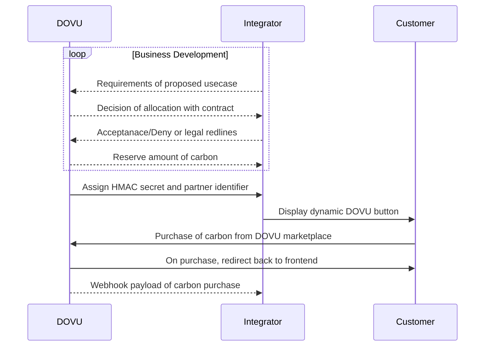

# Integrating with DOVU Market 🕊
 
In this document you will learn how you can work with DOVU to support the purchase of DOVU's fully auditable carbon credits on behalf of your clients.

> Please note, this is an evolving documentation and may be subject to change, we will always take "best effort" precautions for the communication of the backwards compatibility of systems.

Below, we will describe the basic flow of what you can expect. It will follow with example payloads of data packets that your systems can receive to keep track of your clients purchasing carbon credits through the [DOVU marketplace](https://app.dovu.market/).

## Your interaction with DOVU, a flow.

As fully-auditable carbon credits are a highly limited resource we will work with whitelisted clients on a one-on-one basis to ensure that we can reserve enough carbon for qualifying use cases.



## Starting an integration

You should provide these items to DOVU before starting an integration:

1. Company name
2. DOVU Market Webhook Endpoint (we will test this with a "hello world" request)
3. Redirect Endpoint (Redirecting back to a SaaS platform)

You will receive these following items when you start integrating with DOVU.

1. Partner identifier
2. HMAC Secret Key

Your partner identifier allows us to notify your application when a purchase is made. You should combine all interactions with the DOVU marketplace with a **ref** to identify a given customer for your incoming webhook.

## Example Button/Structure

We will provide example brand assets to assist with integrating a DOVU offset button on your service. Currently, you are free to use whatever styling you wish however we would prefer that you add the DOVU logo.

The button and link will be dynamic and it will display to a consumer how much carbon they need to offset.

Our medium-term aim will be to provide a dynamic button which will be similar in behaviour to [PayPal button](https://developer.paypal.com/demo/checkout/#/pattern/client) as a simple integration.

```
https://dovu.market/{partner-identifier}?amount={carbon-amount}&ref={customer-reference}
```

## After purchase flow

The partner identifier will be stored within the cookies of a given Consumer, this will provide them access to your reserved carbon, when they complete a purchase they can be redirected back to your platform, and a corresponding webhook will be sent to your system.

### Example webhook payload

Below is the example payload with a specification of what your server will receive. 

It is ultimately up to you (but highly recommended) whether you wish to include the HMAC verification, using your **HMAC Secret Key** provided earlier to decode the message and verify DOVU is the correct originator.

Please follow our documentation for [Guardian security on how to construct and deal with HMAC](https://github.com/dovuofficial/guardian-middleware-api#security) you can also follow our implementation of [validation of HMAC signatures](https://github.com/dovuofficial/guardian-middleware-api/blob/main/src/utils/hmac.ts).  

#### Headers

This below signature is using the **HMAC Secret Key** of *"secret"*, so you will be able to test and compare generated signatures with the example payload. 

```json
{
  "x-signature": "Qtt+sLAN4WvCMbup4feMayUepwTp0vma0Y3men4Anoo="
}
```

#### Payload 

The payload is constructed of four items:

- context: A duplication of your partner identifier.
- reference: A reference to your customer that is offsetting carbon through the marketplace, will be null if no ref is provided.
- retirement-tx: This identifier is a state proof ready string that links back to a Hedera transaction.
- retired-kgs: The amount of kgs that have been retired from the transaction.
- reserve-remaining-kg: This provides a figure for the remaining kilograms that have been reserved for you after retirement.

```json
{
  "data": {
    "context": "partner-identifier",
    "reference": "customer-ref",
    "retirement-tx": "0.0.1156-1663839551-50378818",
    "retired-kgs": 10,
    "reserve-remaining-kg": 2000
  }
}
```

### Stateproof Generation

DOVU uses state proofs to indicate when a particular purchase of carbon has been retired as a fixed point in time, this is simply a transfer. We then generate the certificates which customers can view from their DOVU dashboard. 

Upon receiving and validating the webhook you can generate a state proof through the above **retirement-tx** using this endpoint below, on testnet. These state proofs can be large, So the onus is on the integrator to have a GET request to the [Hedera Mirror Node](https://docs.hedera.com/guides/mirrornet/hedera-mirror-node) stateproof endpoint. 

```
https://testnet.mirrornode.hedera.com/api/v1/transactions/0.0.1156-1663839551-50378818/stateproof
```

### Understanding the context of retirement-tx (coming soon) 

We make the assumption that businesses want to select multiple projects for there clients to diversify the offering of carbon, because of this there would naturally be many *retirement-tx* values that represent the transfer events of different carbon tokens.

So, to solve this DOVU has a dedicated topic to log a group of retirement events, for a single order. When a message is pushed onto the topic, the *transaction-id* can be used to generate the required stateproof of the *collection of retirements*. 

Each message will have a reference to many retirement transactions in this illustrated format, inside the topic

```json
{
  "retirement-txs": [
    "0.0.1156-1663839551-50378818",
    "0.0.1156-1663839551-50378819",
    "0.0.1156-1663839551-50378820"
  ]
}
```

This solution provides the flexibility of a pointer to many events while if you login to your business account you can look at the generated certificate for each individual carbon retirement event.

## Final Words

Currently, our B2B integration features are in constant development. We will happily consider adding additional features and APIs to support your business requirements, just give us a shout! 
